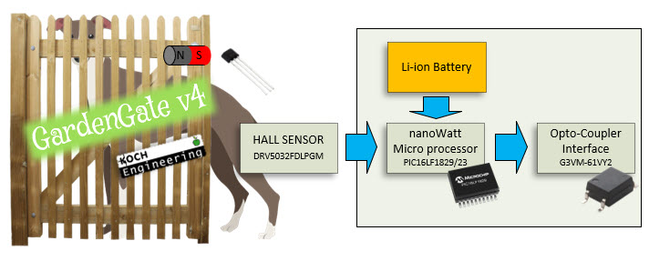
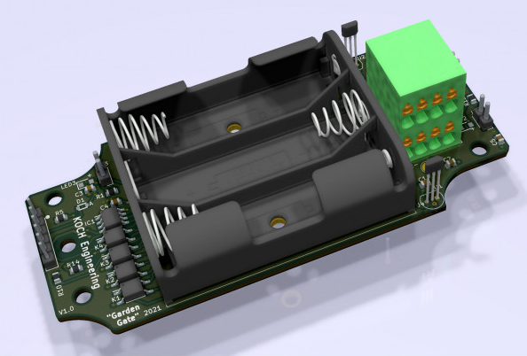

<!-- PROJECT SHIELDS -->

[![Contributors][contributors-shield]][contributors-url]
[![Forks][forks-shield]][forks-url]
[![Stargazers][stars-shield]][stars-url]
[![Issues][issues-shield]][issues-url]
[![MIT License][license-shield]][license-url]
[![LinkedIn][linkedin-shield]][linkedin-url]


<!-- PROJECT LOGO -->
<br />
<p align="center">
  <a href="https://https://github.com/henrikkoch/GardenGate">
    
    
  </a>

  <h3 align="center">GardenGate</h3>

  <p align="center">
    This project is about to monitor garden gates and signal that back to my IHC house control system. This is done by interfacing a nanoWatt power Microchip microcontroller who checks door state by a a sensor. The most of the time the microcontroller is sleeping. On door change or sleep timeout the door state is being checked. This is being interfaced to a IHC wireless 4 ch. transmitter. 3 channels are being used. A signal to indicate DOOR CLOSED and another signal (channel) DOOR OPENED and also another channel to take care for signaling if the microcontroler battery is on critical voltage (being measured by the microcontroller once a day)
    <br />
    <a href="https://github.com/henrikkoch/GardenGateNew"><strong>Explore the docs »</strong></a>
    <br />
    <br />
    <a href="https://github.com/henrikkoch/GardenGateNew">View Demo</a>
    ·
    <a href="https://github.com/henrikkoch/GardenGateNew/issues">Report Bug</a>
    ·
    <a href="https://github.com/henrikkoch/GardenGateNew">Request Feature</a>
  </p>
</p>


<!-- TABLE OF CONTENTS -->
<details open="open">
  <summary><h2 style="display: inline-block">Table of Contents</h2></summary>
  <ol>
    <li>
      <a href="#about-the-project">About The Project</a>
      <ul>
        <li><a href="#built-with">Built With</a></li>
      </ul>
    </li>
    <li>
      <a href="#getting-started">Getting Started</a>
      <ul>
        <li><a href="#prerequisites">Prerequisites</a></li>
        <li><a href="#installation">Installation</a></li>
      </ul>
    </li>
    <li><a href="#usage">Usage</a></li>
    <li><a href="#roadmap">Roadmap</a></li>
    <li><a href="#contributing">Contributing</a></li>
    <li><a href="#license">License</a></li>
    <li><a href="#contact">Contact</a></li>
    <li><a href="#acknowledgements">Acknowledgements</a></li>
  </ol>
</details>


<!-- ABOUT THE PROJECT -->
## About The Project

[Product Link](https://kochshop.dk/GardenGateDK)

 


### Built With

* [MPLAB X IDE v5.45](https://ww1.microchip.com/downloads/en/DeviceDoc/MPLABX-v5.45-windows-installer.exe)
* [XC-8-cc v.2.32](https://www.microchip.com/mplabxc8windows)


<!-- GETTING STARTED -->
## Getting Started

To get a local copy up and running follow these simple steps.

### Prerequisites

This is an example of how to list things you need to use the software and how to install them.
* npm
  ```sh
  npm install npm@latest -g
  ```

### Installation

1. Clone the repo
   ```sh
   git clone https://https://github.com/henrikkoch/GardenGate.git
   ```
2. Install NPM packages
   ```sh
   npm install
   ```


<!-- USAGE EXAMPLES -->
## Usage

Use this space to show useful examples of how a project can be used. Additional screenshots, code examples and demos work well in this space. You may also link to more resources.

_For more examples, please refer to the [Documentation](https://example.com)_


<!-- ROADMAP -->
## Roadmap

See the [open issues](https://github.com/henrikkoch/GardenGate/issues) for a list of proposed features (and known issues).


<!-- CONTRIBUTING -->
## Contributing

Contributions are what make the open source community such an amazing place to be learn, inspire, and create. Any contributions you make are **greatly appreciated**.

1. Fork the Project
2. Create your Feature Branch (`git checkout -b feature/AmazingFeature`)
3. Commit your Changes (`git commit -m 'Add some AmazingFeature'`)
4. Push to the Branch (`git push origin feature/AmazingFeature`)
5. Open a Pull Request


<!-- LICENSE -->
## License

Distributed under the MIT License. See `LICENSE` for more information.


<!-- CONTACT -->
## Contact

Henrik J. Koch
 - [Linkedin](https://www.linkedin.com/in/henrikjkoch) 
 - [Twitter](https://twitter.com/henrikjkoch) 
 - [Instagram](https://www.instagram.com/henrikkoch)
 - [e-mail](mailto:henrik@koch-engineering.com)

Project Link: [github](https://github.com/henrikkoch/GardenGate)

<!-- ACKNOWLEDGEMENTS -->
## Acknowledgements

* [MikroElektronika MIKROE Click boards](https://www.mikroe.com/7seg-click)
* [Microchip Curiosity Development Board](https://www.microchip.com/en-us/development-tool/dm164137)
* [MPLAB® ICD 4 In-Circuit Debugger](https://www.microchip.com/en-us/development-tool/DV164045)
* [MPLAB® XC8 Compiler](https://ww1.microchip.com/downloads/en/DeviceDoc/MPLAB-XC8-C-Compiler-Legacy-Users-Guide-DS50002053J.pdf)
* [IHC Captain](https://jemi.dk/ihc/)
* [Lauritz Knudsen - Intelligent House Control - IHC](https://www.lk.dk/professionel/produktoversigt/intelligente-systemer/ihc/)


<!-- MARKDOWN LINKS & IMAGES -->
<!-- https://www.markdownguide.org/basic-syntax/#reference-style-links -->
<!-- https://img.shields.io/github/release-date/henrikkoch/GardenGateNew?style=for-the-badge -->
[contributors-shield]: https://img.shields.io/github/contributors/henrikkoch/GardenGateNew?style=for-the-badge
[contributors-url]: https://github.com/henrikkoch/GardenGateNew/graphs/contributors
[forks-shield]: https://img.shields.io/github/forks/henrikkoch/GardenGateNew?style=for-the-badge
[forks-url]: https://github.com/henrikkoch/GardenGateNew/network/members
[stars-shield]: https://img.shields.io/github/stars/henrikkoch/GardenGateNew?style=for-the-badge
[stars-url]: https://github.com/henrikkoch/GardenGate/stargazers
[issues-shield]: https://img.shields.io/github/issues/henrikkoch/GardenGateNew?style=for-the-badge
[issues-url]: https://github.com/henrikkoch/GardenGateNew/issues
[License-shield]: https://img.shields.io/badge/License-CC_BY--NC--ND_4.0-lightgrey.svg?style=for-the-badge
[license-url]: https://creativecommons.org/licenses/by-nc-nd/4.0/
[linkedin-shield]: https://img.shields.io/badge/-LinkedIn-black.svg?style=for-the-badge&logo=linkedin&colorB=555
[linkedin-url]: https://www.linkedin.com/in/henrikjkoch/
